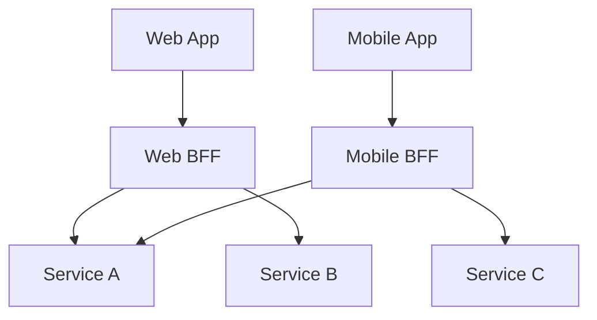

# Architecture Rules

# Service Boundaries

## Defining Service Boundaries

Each service should own a specific business capability:

```
✅ Good Boundaries:
- User Service: Authentication, profiles, preferences
- Order Service: Order processing, fulfillment
- Payment Service: Payment processing, billing
- Notification Service: Emails, SMS, push notifications

❌ Bad Boundaries:
- Data Access Service (technical, not business)
- Utility Service (too generic)
- God Service (does everything)
```

## Bounded Contexts

Use Domain-Driven Design to identify boundaries:

- Each service represents a bounded context
- Services are organized around business domains
- Clear ownership of data and logic
- Services should be independently deployable

## Ownership Rules

**Each service:**
- Owns its own database (no shared databases)
- Owns its domain logic
- Exposes well-defined APIs
- Can be developed by autonomous teams

## Communication Rules

**Avoid:**
- Direct database access between services
- Chatty communication (N+1 service calls)
- Tight coupling through shared libraries

**Prefer:**
- API-based communication
- Event-driven for data synchronization
- Async messaging where possible

## Data Ownership

```text
// ✅ Good - Service owns its data
Class OrderService:
  Method CreateOrder(data):
    # Order service owns order data
    Order = OrderRepository.Save(data)

    # Publish event for other services
    EventBus.Publish("order.created", {
      orderId: Order.id,
      userId: Order.userId,
      total: Order.total
    })

    Return Order

// ❌ Bad - Direct access to another service's database
Class OrderService:
  Method CreateOrder(data):
    # Don't do this!
    User = UserDatabase.FindOne({ id: data.userId })
```

## Sizing Guidelines

Keep services:
- Small enough to be maintained by a small team (2-3 developers)
- Large enough to provide business value
- Focused on a single bounded context
- Independently deployable and scalable


---

# Microservices Communication

## Synchronous vs Asynchronous

```text
# ⚠️ Synchronous creates coupling and multiplicative downtime
# If Service A calls B calls C, any failure breaks the chain

# ✅ Prefer asynchronous messaging for most inter-service communication
# Limit synchronous calls to one per user request

# Async Message Format Example
Event: "order.created"
Data: {
  orderId: "ord_123",
  userId: "user_456",
  items: [...]
}

# Subscribers process independently
Service Inventory -> ReserveItems(items)
Service Notification -> SendEmail(user)
```

## API-Based Communication

```text
# ✅ Well-defined REST APIs between services
GET /users/{userId}

# ✅ Use circuit breaker for resilience
Function getUserSafe(userId):
  Try:
    return UserClient.getUser(userId)
  Catch Error:
    return getCachedUser(userId) # Fallback
```

## Event-Driven Integration

```text
# ✅ Publish events for state changes
Function CreateOrder(data):
  order = Repository.Save(data)
  
  # Failures here don't block the user
  EventBus.Publish("order.created", {
    orderId: order.id,
    userId: order.userId,
    timestamp: Now()
  })

  return order

# ✅ Consumers handle events independently (Decoupled)
Service Notification:
  On("order.created"): SendConfirmation(event)

Service Inventory:
  On("order.created"): ReserveInventory(event)
```

## Tolerant Reader Pattern

```text
# ✅ Don't fail on unknown fields - enables independent evolution
Structure UserResponse:
  id: string
  name: string
  ...ignore other fields...

# ✅ Use sensible defaults for missing optional fields
Function ParseUser(data):
  return User {
    id: data.id,
    name: data.name,
    role: data.role OR 'user',   # Default
    avatar: data.avatar OR null
  }
```

## Anti-Patterns

```text
# ❌ Chatty communication (N+1 service calls)
For each orderId in orderIds:
  GetOrder(orderId)  # N network calls!

# ✅ Batch requests
GetOrders(orderIds)  # 1 network call

# ❌ Tight coupling via shared databases
# Service A directly queries Service B's tables

# ✅ API-based communication
UserClient.GetUsers(userIds)
```


---

# Microservices Data Management

## Database Per Service

```
Each service owns its database:

✅ Order Service → order_db (PostgreSQL)
✅ User Service → user_db (PostgreSQL)
✅ Catalog Service → catalog_db (MongoDB)
✅ Search Service → search_index (Elasticsearch)

❌ Never share databases between services
❌ Never query another service's tables directly
```

## Polyglot Persistence

```text
# Each service uses the best database for its needs

# User Service -> Relational (ACID, relationships)
Repository UserRepository:
  Method Create(user):
    SQL "INSERT INTO users..."

# Catalog Service -> Document (Flexible schema)
Repository ProductRepository:
  Method Create(product):
    Collection("products").Insert(product)

# Analytics Service -> Time-Series (High write volume)
Repository MetricsRepository:
  Method Record(metric):
    InfluxDB.Write(metric)
```

## Eventual Consistency

```text
# ✅ Embrace eventual consistency for cross-service data

1. Order Service: Save Order -> Publish "order.created"
2. Inventory Service: Listen "order.created" -> Reserve Inventory

# Data may be temporarily inconsistent - that's OK

# ✅ Use compensating actions for failures
Function ProcessOrder(order):
  Try:
    InventoryService.Reserve(order.items)
    PaymentService.Charge(order.total)
  Catch Error:
    # Compensate: undo previous actions
    InventoryService.Release(order.items)
    Throw Error
```

## Data Synchronization Patterns

```text
# Pattern: Event Sourcing / CQRS
Service OrderQuery:
  On("product.updated"):
    # Update local read-optimized copy
    Cache.Set(event.productId, { name: event.name, price: event.price })

# Pattern: Saga for distributed transactions
Saga CreateOrder:
  Step 1:
    Action: Inventory.Reserve()
    Compensate: Inventory.Release()
  Step 2:
    Action: Payment.Charge()
    Compensate: Payment.Refund()
```

## Data Ownership

```text
# ✅ Each service is the source of truth for its data
Service User:
  Function UpdateEmail(userId, email):
    Database.Update(userId, email)
    EventBus.Publish("user.email.changed", { userId, email })

# Other services maintain their own copies (projections)
Service Order:
  On("user.email.changed"):
    # Update local cache, never query User DB directly
    LocalUserCache.Update(event.userId, event.email)
```


---

# Microservices Resilience

## Circuit Breaker Pattern

```text
Class CircuitBreaker:
  State: CLOSED | OPEN | HALF_OPEN
  
  Method Execute(operation):
    If State is OPEN:
      If TimeoutExpired:
        State = HALF_OPEN
      Else:
        Throw Error("Circuit Open")
    
    Try:
      Result = operation()
      OnSuccess()
      Return Result
    Catch Error:
      OnFailure()
      Throw Error
```

## Retry with Exponential Backoff

```text
Function Retry(operation, maxAttempts, baseDelay):
  For attempt in 1..maxAttempts:
    Try:
      return operation()
    Catch Error:
      If attempt == maxAttempts: Throw Error
      
      # Exponential Backoff + Jitter
      delay = baseDelay * (2 ^ attempt) + RandomJitter()
      Sleep(delay)
```

## Bulkhead Pattern

```text
# Isolate resources to prevent cascading failures
Class Bulkhead:
  MaxConcurrent = 5
  Active = 0
  
  Method Execute(operation):
    If Active >= MaxConcurrent:
      Throw Error("Bulkhead Full")
      
    Active++
    Try:
      return operation()
    Finally:
      Active--

# Usage: Separate bulkheads per dependency
PaymentBulkhead = New Bulkhead(5)
EmailBulkhead = New Bulkhead(10)
```

## Timeouts

```text
Function WithTimeout(operation, timeoutMs):
  Race:
    1. Result = operation()
    2. Sleep(timeoutMs) -> Throw Error("Timeout")

# Always set timeouts for external calls
Result = WithTimeout(UserService.GetUser(id), 5000)
```

## Graceful Degradation

```text
Function GetProductRecommendations(userId):
  Try:
    return RecommendationService.GetPersonalized(userId)
  Catch Error:
    # Fallback to cached popular items
    Log("Recommendation service unavailable")
    return GetPopularProducts()

# Partial responses instead of complete failure
Function GetDashboard(userId):
  User = GetUser(userId) OR null
  Orders = GetOrders(userId) OR []
  Stats = GetStats(userId) OR null

  return { User, Orders, Stats }
```

## Health Checks

```text
Endpoint GET /health:
  Checks = [
    CheckDatabase(),
    CheckRedis(),
    CheckExternalAPI()
  ]
  
  Healthy = All(Checks) passed
  
  Return HTTP 200/503 {
    status: Healthy ? "healthy" : "degraded",
    checks: { ...details... }
  }
```


---

# API Gateway

## Overview

An API Gateway acts as a single entry point for a group of microservices. It handles cross-cutting concerns and routes requests to the appropriate backend services.

## Core Responsibilities

1.  **Routing**: Forwarding requests to the correct service (e.g., `/api/users` -> User Service).
2.  **Authentication & Authorization**: Verifying identity and permissions at the edge.
3.  **Rate Limiting**: Protecting services from abuse.
4.  **Protocol Translation**: Converting public HTTP/REST to internal gRPC or AMQP.
5.  **Response Aggregation**: Combining data from multiple services into a single response.

## Patterns

### Backend for Frontend (BFF)

Create separate gateways for different client types (Mobile, Web, 3rd Party) to optimize the API for each consumer.



## Implementation

### Cross-Cutting Concerns

Handle these at the gateway to keep microservices focused on business logic:

- **SSL Termination**: Decrypt HTTPS at the gateway.
- **CORS**: Handle Cross-Origin Resource Sharing headers.
- **Request Validation**: Basic schema validation before hitting services.
- **Caching**: Cache common responses.

### When to Use

| Use API Gateway When... | Avoid API Gateway When... |
|-------------------------|---------------------------|
| You have multiple microservices | You have a monolithic application |
| You need centralized auth/security | You need ultra-low latency (extra hop) |
| You have diverse clients (Web, Mobile) | Your architecture is very simple |

## Best Practices

- **Keep it Logic-Free**: Don't put business logic in the gateway. It should be a router, not a processor.
- **High Availability**: The gateway is a single point of failure; deploy it in a cluster.
- **Observability**: Ensure the gateway generates trace IDs and logs all traffic.


---

# Modular Monolith Structure

## Project Organization

```
project-root/
├── apps/
│   └── api/
│       ├── src/
│       │   ├── app/              # Application bootstrap
│       │   ├── modules/          # Business modules
│       │   │   ├── auth/
│       │   │   ├── user/
│       │   │   ├── booking/
│       │   │   ├── payment/
│       │   │   └── notification/
│       │   ├── common/           # Shared infrastructure
│       │   │   ├── decorators/
│       │   │   ├── guards/
│       │   │   └── interceptors/
│       │   └── prisma/           # Database service
│       └── main.ts
├── libs/                         # Shared libraries
│   └── shared-types/
└── package.json
```

## Module Structure

```
modules/booking/
├── entities/              # Domain models and DTOs
│   ├── booking.entity.ts
│   ├── create-booking.dto.ts
│   └── booking-response.dto.ts
├── repositories/          # Data access layer
│   └── booking.repository.ts
├── services/              # Business logic
│   ├── booking.service.ts
│   └── availability.service.ts
├── controllers/           # HTTP/API layer
│   └── bookings.controller.ts
└── booking.module.ts      # Module definition
```

## Module Definition

```typescript
@Module({
  imports: [
    PrismaModule,
    forwardRef(() => AuthModule),
    NotificationsModule,
  ],
  controllers: [BookingsController],
  providers: [
    BookingService,
    AvailabilityService,
    BookingRepository,
  ],
  exports: [BookingService], // Only export public API
})
export class BookingsModule {}
```

## Layered Architecture Within Modules

```typescript
// Controller - HTTP layer
@Controller('api/v1/bookings')
export class BookingsController {
  constructor(private bookingService: BookingService) {}

  @Get('calendar')
  async getCalendarBookings(@Query() dto: GetBookingsDto) {
    return this.bookingService.getBookingsForCalendar(dto);
  }
}

// Service - Business logic
@Injectable()
export class BookingService {
  constructor(
    private bookingRepository: BookingRepository,
    private availabilityService: AvailabilityService,
  ) {}

  async getBookingsForCalendar(dto: GetBookingsDto) {
    const bookings = await this.bookingRepository.findByDateRange(
      dto.startDate,
      dto.endDate
    );
    return bookings.map(this.mapToCalendarDto);
  }
}

// Repository - Data access
@Injectable()
export class BookingRepository {
  constructor(private prisma: PrismaService) {}

  async findByDateRange(start: Date, end: Date) {
    return this.prisma.booking.findMany({
      where: {
        startTime: { gte: start },
        endTime: { lte: end }
      }
    });
  }
}
```

## Shared Infrastructure

```typescript
// common/guards/jwt-auth.guard.ts
@Injectable()
export class JwtAuthGuard extends AuthGuard('jwt') {
  canActivate(context: ExecutionContext) {
    const isPublic = this.reflector.get<boolean>('isPublic', context.getHandler());
    return isPublic ? true : super.canActivate(context);
  }
}

// common/decorators/current-user.decorator.ts
export const CurrentUser = createParamDecorator(
  (data: unknown, ctx: ExecutionContext) => {
    return ctx.switchToHttp().getRequest().user;
  }
);
```


---

# Modular Monolith Boundaries

## High Cohesion, Low Coupling

```typescript
// ❌ Bad: Tight coupling - direct repository access
@Injectable()
export class OrderService {
  constructor(private userRepo: UserRepository) {} // Crosses module boundary

  async createOrder(userId: string) {
    const user = await this.userRepo.findById(userId); // Direct access
  }
}

// ✅ Good: Loose coupling via service
@Injectable()
export class OrderService {
  constructor(private userService: UserService) {} // Service dependency

  async createOrder(userId: string) {
    const user = await this.userService.findById(userId); // Through public API
  }
}
```

## No Direct Cross-Module Database Access

```typescript
// ❌ Never query another module's tables directly
class BookingService {
  async createBooking(data: CreateBookingDto) {
    const user = await this.prisma.user.findUnique({ where: { id: data.userId } });
    // This bypasses the User module!
  }
}

// ✅ Use the module's public service API
class BookingService {
  constructor(private userService: UserService) {}

  async createBooking(data: CreateBookingDto) {
    const user = await this.userService.findById(data.userId);
    // Properly goes through User module
  }
}
```

## Separated Interface Pattern

```typescript
// Define interface in consuming module
// modules/order/interfaces/user-provider.interface.ts
export interface UserProvider {
  findById(id: string): Promise<User>;
  validateUser(id: string): Promise<boolean>;
}

// Implement in providing module
// modules/user/user.service.ts
@Injectable()
export class UserService implements UserProvider {
  async findById(id: string): Promise<User> {
    return this.userRepo.findById(id);
  }

  async validateUser(id: string): Promise<boolean> {
    const user = await this.findById(id);
    return user && user.isActive;
  }
}
```

## Domain Events for Loose Coupling

```typescript
// ✅ Publish events instead of direct calls
@Injectable()
export class UserService {
  constructor(private eventEmitter: EventEmitter2) {}

  async createUser(dto: CreateUserDto): Promise<User> {
    const user = await this.userRepo.create(dto);

    this.eventEmitter.emit('user.created', new UserCreatedEvent(user.id, user.email));

    return user;
  }
}

// Other modules subscribe to events
@Injectable()
export class NotificationListener {
  @OnEvent('user.created')
  async handleUserCreated(event: UserCreatedEvent) {
    await this.notificationService.sendWelcomeEmail(event.email);
  }
}
```

## Handling Circular Dependencies

```typescript
// Use forwardRef() when modules depend on each other
@Module({
  imports: [
    forwardRef(() => AuthModule), // Break circular dependency
    UserModule,
  ],
})
export class UserModule {}

@Module({
  imports: [
    forwardRef(() => UserModule),
  ],
})
export class AuthModule {}
```

## Export Only What's Necessary

```typescript
@Module({
  providers: [
    UserService,        // Public service
    UserRepository,     // Internal
    PasswordHasher,     // Internal
  ],
  exports: [UserService], // Only export the service, not internals
})
export class UserModule {}
```


---

# SOLID Principles

## Single Responsibility Principle (SRP)

A class should have only one reason to change.

**Bad:**
```typescript
class UserService {
  createUser(data: UserData): User { /* ... */ }
  sendWelcomeEmail(user: User): void { /* ... */ }
  generateReport(users: User[]): Report { /* ... */ }
}
```

**Good:**
```typescript
class UserService {
  createUser(data: UserData): User { /* ... */ }
}

class EmailService {
  sendWelcomeEmail(user: User): void { /* ... */ }
}

class ReportService {
  generateUserReport(users: User[]): Report { /* ... */ }
}
```

## Open/Closed Principle (OCP)

Open for extension, closed for modification.

**Bad:**
```typescript
class PaymentProcessor {
  process(payment: Payment): void {
    if (payment.type === 'credit') { /* credit logic */ }
    else if (payment.type === 'paypal') { /* paypal logic */ }
    // Must modify class to add new payment types
  }
}
```

**Good:**
```typescript
interface PaymentHandler {
  process(payment: Payment): void;
}

class CreditCardHandler implements PaymentHandler {
  process(payment: Payment): void { /* credit logic */ }
}

class PayPalHandler implements PaymentHandler {
  process(payment: Payment): void { /* paypal logic */ }
}

class PaymentProcessor {
  constructor(private handlers: Map<string, PaymentHandler>) {}

  process(payment: Payment): void {
    this.handlers.get(payment.type)?.process(payment);
  }
}
```

## Liskov Substitution Principle (LSP)

Subtypes must be substitutable for their base types.

**Bad:**
```typescript
class Bird {
  fly(): void { /* flying logic */ }
}

class Penguin extends Bird {
  fly(): void {
    throw new Error("Penguins can't fly!"); // Violates LSP
  }
}
```

**Good:**
```typescript
interface Bird {
  move(): void;
}

class FlyingBird implements Bird {
  move(): void { this.fly(); }
  private fly(): void { /* flying logic */ }
}

class Penguin implements Bird {
  move(): void { this.swim(); }
  private swim(): void { /* swimming logic */ }
}
```

## Interface Segregation Principle (ISP)

Clients shouldn't depend on interfaces they don't use.

**Bad:**
```typescript
interface Worker {
  work(): void;
  eat(): void;
  sleep(): void;
}

class Robot implements Worker {
  work(): void { /* ... */ }
  eat(): void { throw new Error("Robots don't eat"); }
  sleep(): void { throw new Error("Robots don't sleep"); }
}
```

**Good:**
```typescript
interface Workable {
  work(): void;
}

interface Eatable {
  eat(): void;
}

interface Sleepable {
  sleep(): void;
}

class Human implements Workable, Eatable, Sleepable {
  work(): void { /* ... */ }
  eat(): void { /* ... */ }
  sleep(): void { /* ... */ }
}

class Robot implements Workable {
  work(): void { /* ... */ }
}
```

## Dependency Inversion Principle (DIP)

Depend on abstractions, not concretions.

**Bad:**
```typescript
class UserService {
  private database = new MySQLDatabase();

  getUser(id: string): User {
    return this.database.query(`SELECT * FROM users WHERE id = '${id}'`);
  }
}
```

**Good:**
```typescript
interface Database {
  query(sql: string): any;
}

class UserService {
  constructor(private database: Database) {}

  getUser(id: string): User {
    return this.database.query(`SELECT * FROM users WHERE id = '${id}'`);
  }
}

// Can inject any database implementation
const userService = new UserService(new MySQLDatabase());
const testService = new UserService(new InMemoryDatabase());
```

## Best Practices

- Apply SRP at class, method, and module levels
- Use interfaces and dependency injection for flexibility
- Prefer composition over inheritance
- Design small, focused interfaces
- Inject dependencies rather than creating them internally


---

# Clean Architecture

## Core Principle

Dependencies point inward. Inner layers know nothing about outer layers.

```
┌─────────────────────────────────────────────┐
│            Frameworks & Drivers             │
│  ┌─────────────────────────────────────┐    │
│  │       Interface Adapters            │    │
│  │  ┌─────────────────────────────┐    │    │
│  │  │     Application Business    │    │    │
│  │  │  ┌─────────────────────┐    │    │    │
│  │  │  │  Enterprise Business│    │    │    │
│  │  │  │     (Entities)      │    │    │    │
│  │  │  └─────────────────────┘    │    │    │
│  │  │       (Use Cases)           │    │    │
│  │  └─────────────────────────────┘    │    │
│  │    (Controllers, Gateways)          │    │
│  └─────────────────────────────────────┘    │
│      (Web, DB, External APIs)               │
└─────────────────────────────────────────────┘
```

## The Dependency Rule

Source code dependencies only point inward.

## Layer Structure

### Entities (Enterprise Business Rules)

```typescript
class Order {
  constructor(
    public readonly id: string,
    private items: OrderItem[],
    private status: OrderStatus
  ) {}

  calculateTotal(): Money {
    return this.items.reduce(
      (sum, item) => sum.add(item.subtotal()),
      Money.zero()
    );
  }

  canBeCancelled(): boolean {
    return this.status === OrderStatus.Pending;
  }
}
```

### Use Cases (Application Business Rules)

```typescript
class CreateOrderUseCase {
  constructor(
    private orderRepository: OrderRepository,
    private productRepository: ProductRepository
  ) {}

  async execute(request: CreateOrderRequest): Promise<CreateOrderResponse> {
    const products = await this.productRepository.findByIds(request.productIds);
    const order = new Order(generateId(), this.createItems(products));
    await this.orderRepository.save(order);
    return { orderId: order.id };
  }
}
```

### Interface Adapters

```typescript
// Controller (adapts HTTP to use case)
class OrderController {
  constructor(private createOrder: CreateOrderUseCase) {}

  async create(req: Request, res: Response) {
    const result = await this.createOrder.execute(req.body);
    res.json(result);
  }
}

// Repository Implementation (adapts use case to database)
class PostgreSQLOrderRepository implements OrderRepository {
  async save(order: Order): Promise<void> {
    await this.db.query('INSERT INTO orders...');
  }
}
```

### Frameworks & Drivers

```typescript
// Express setup
const app = express();
app.post('/orders', (req, res) => orderController.create(req, res));

// Database connection
const db = new Pool({ connectionString: process.env.DATABASE_URL });
```

## Best Practices

- Keep entities pure with no framework dependencies
- Use cases orchestrate domain logic
- Interfaces defined in inner layers, implemented in outer layers
- Cross boundaries with simple data structures
- Test use cases independently of frameworks


---

# DDD Tactical Patterns

## Entities

Objects with identity that persists through state changes.

```typescript
class User {
  constructor(
    public readonly id: UserId,
    private email: Email,
    private name: string
  ) {}

  changeEmail(newEmail: Email): void {
    this.email = newEmail;
  }

  equals(other: User): boolean {
    return this.id.equals(other.id);
  }
}
```

## Value Objects

Immutable objects defined by their attributes.

```typescript
class Email {
  private readonly value: string;

  constructor(email: string) {
    if (!this.isValid(email)) {
      throw new InvalidEmailError(email);
    }
    this.value = email.toLowerCase();
  }

  equals(other: Email): boolean {
    return this.value === other.value;
  }
}

class Money {
  constructor(
    public readonly amount: number,
    public readonly currency: Currency
  ) {
    Object.freeze(this);
  }

  add(other: Money): Money {
    this.assertSameCurrency(other);
    return new Money(this.amount + other.amount, this.currency);
  }
}
```

## Aggregates

Cluster of entities and value objects with a root entity.

```typescript
class Order {
  private items: OrderItem[] = [];

  constructor(
    public readonly id: OrderId,
    private customerId: CustomerId
  ) {}

  addItem(product: Product, quantity: number): void {
    const item = new OrderItem(product.id, product.price, quantity);
    this.items.push(item);
  }

  // All modifications go through aggregate root
  removeItem(productId: ProductId): void {
    this.items = this.items.filter(item => !item.productId.equals(productId));
  }
}
```

## Domain Events

Capture something that happened in the domain.

```typescript
class OrderPlaced implements DomainEvent {
  constructor(
    public readonly orderId: OrderId,
    public readonly customerId: CustomerId,
    public readonly occurredOn: Date = new Date()
  ) {}
}

class Order {
  private events: DomainEvent[] = [];

  place(): void {
    this.status = OrderStatus.Placed;
    this.events.push(new OrderPlaced(this.id, this.customerId));
  }

  pullEvents(): DomainEvent[] {
    const events = [...this.events];
    this.events = [];
    return events;
  }
}
```

## Repositories

Abstract persistence for aggregates.

```typescript
interface OrderRepository {
  findById(id: OrderId): Promise<Order | null>;
  save(order: Order): Promise<void>;
  nextId(): OrderId;
}
```

## Best Practices

- One repository per aggregate root
- Aggregates should be small
- Reference other aggregates by ID
- Publish domain events for cross-aggregate communication
- Keep value objects immutable


---

# DDD Strategic Patterns

## Ubiquitous Language

Use the same terminology in code, documentation, and conversations.

```typescript
// Domain experts say "place an order"
class Order {
  place(): void { /* not submit(), not create() */ }
}

// Domain experts say "items are added to cart"
class ShoppingCart {
  addItem(product: Product): void { /* not insert(), not push() */ }
}
```

## Bounded Contexts

Explicit boundaries where a model applies consistently.

```
┌─────────────────┐    ┌─────────────────┐
│    Sales        │    │   Warehouse     │
│    Context      │    │    Context      │
├─────────────────┤    ├─────────────────┤
│ Order           │    │ Order           │
│ - customerId    │    │ - shipmentId    │
│ - items[]       │    │ - pickingList   │
│ - total         │    │ - status        │
└─────────────────┘    └─────────────────┘
   Same term, different model
```

## Context Mapping Patterns

### Shared Kernel
Two contexts share a subset of the model.

### Customer/Supplier
Upstream context provides what downstream needs.

### Conformist
Downstream adopts upstream's model entirely.

### Anti-Corruption Layer
Translate between contexts to protect domain model.

```typescript
class InventoryAntiCorruptionLayer {
  constructor(private legacyInventorySystem: LegacyInventory) {}

  checkAvailability(productId: ProductId): Promise<boolean> {
    // Translate from legacy format to domain model
    const legacyResult = await this.legacyInventorySystem.getStock(
      productId.toString()
    );
    return legacyResult.qty > 0;
  }
}
```

## Module Organization

```
src/
├── sales/                    # Sales bounded context
│   ├── domain/
│   │   ├── order.ts
│   │   └── customer.ts
│   ├── application/
│   │   └── place-order.ts
│   └── infrastructure/
│       └── order-repository.ts
├── warehouse/                # Warehouse bounded context
│   ├── domain/
│   │   └── shipment.ts
│   └── ...
└── shared/                   # Shared kernel
    └── money.ts
```

## Best Practices

- Define context boundaries based on team structure and business capabilities
- Use ubiquitous language within each context
- Communicate between contexts via events or explicit APIs
- Protect domain model with anti-corruption layers when integrating legacy systems


---

# Event-Driven Architecture

## Event Sourcing

Store state as a sequence of events.

```typescript
interface Event {
  id: string;
  aggregateId: string;
  type: string;
  data: unknown;
  timestamp: Date;
  version: number;
}

class Account {
  private balance = 0;
  private version = 0;

  static fromEvents(events: Event[]): Account {
    const account = new Account();
    events.forEach(event => account.apply(event));
    return account;
  }

  private apply(event: Event): void {
    switch (event.type) {
      case 'MoneyDeposited':
        this.balance += (event.data as { amount: number }).amount;
        break;
      case 'MoneyWithdrawn':
        this.balance -= (event.data as { amount: number }).amount;
        break;
    }
    this.version = event.version;
  }
}
```

## CQRS (Command Query Responsibility Segregation)

Separate read and write models.

```typescript
// Write Model (Commands)
class OrderCommandHandler {
  async handle(cmd: PlaceOrderCommand): Promise<void> {
    const order = new Order(cmd.orderId, cmd.items);
    await this.eventStore.save(order.changes());
  }
}

// Read Model (Queries)
class OrderQueryService {
  async getOrderSummary(orderId: string): Promise<OrderSummaryDTO> {
    return this.readDb.query('SELECT * FROM order_summaries WHERE id = $1', [orderId]);
  }
}

// Projection updates read model from events
class OrderProjection {
  async handle(event: OrderPlaced): Promise<void> {
    await this.readDb.insert('order_summaries', {
      id: event.orderId,
      status: 'placed',
      total: event.total
    });
  }
}
```

## Saga Pattern

Manage long-running transactions across services.

```typescript
class OrderSaga {
  async execute(orderId: string): Promise<void> {
    try {
      await this.paymentService.charge(orderId);
      await this.inventoryService.reserve(orderId);
      await this.shippingService.schedule(orderId);
    } catch (error) {
      await this.compensate(orderId, error);
    }
  }

  private async compensate(orderId: string, error: Error): Promise<void> {
    await this.shippingService.cancel(orderId);
    await this.inventoryService.release(orderId);
    await this.paymentService.refund(orderId);
  }
}
```

## Event Versioning

Handle schema changes gracefully.

```typescript
interface EventUpgrader {
  upgrade(event: Event): Event;
}

class OrderPlacedV1ToV2 implements EventUpgrader {
  upgrade(event: Event): Event {
    const oldData = event.data as OrderPlacedV1Data;
    return {
      ...event,
      type: 'OrderPlaced',
      version: 2,
      data: {
        ...oldData,
        currency: 'USD' // New field with default
      }
    };
  }
}
```

## Best Practices

- Events are immutable facts
- Include enough context in events for consumers
- Version events from the start
- Use idempotent event handlers
- Design for eventual consistency
- Consider snapshots for aggregates with many events


---

# Event-Driven Messaging

## Message Types

### Commands
Request to perform an action. Directed to a single handler.

```typescript
interface CreateOrderCommand {
  type: 'CreateOrder';
  orderId: string;
  customerId: string;
  items: OrderItem[];
  timestamp: Date;
}

// Single handler processes the command
class CreateOrderHandler {
  async handle(command: CreateOrderCommand): Promise<void> {
    const order = Order.create(command);
    await this.repository.save(order);
    await this.eventBus.publish(new OrderCreatedEvent(order));
  }
}
```

### Events
Notification that something happened. Published to multiple subscribers.

```typescript
interface OrderCreatedEvent {
  type: 'OrderCreated';
  orderId: string;
  customerId: string;
  totalAmount: number;
  occurredAt: Date;
}

// Multiple handlers can subscribe
class InventoryService {
  @Subscribe('OrderCreated')
  async onOrderCreated(event: OrderCreatedEvent): Promise<void> {
    await this.reserveInventory(event.orderId);
  }
}

class NotificationService {
  @Subscribe('OrderCreated')
  async onOrderCreated(event: OrderCreatedEvent): Promise<void> {
    await this.sendConfirmation(event.customerId);
  }
}
```

### Queries
Request for data. Returns a response.

```typescript
interface GetOrderQuery {
  type: 'GetOrder';
  orderId: string;
}

class GetOrderHandler {
  async handle(query: GetOrderQuery): Promise<Order> {
    return this.repository.findById(query.orderId);
  }
}
```

## Message Bus Patterns

### In-Memory Bus

```typescript
class EventBus {
  private handlers = new Map<string, Function[]>();

  subscribe(eventType: string, handler: Function): void {
    const handlers = this.handlers.get(eventType) || [];
    handlers.push(handler);
    this.handlers.set(eventType, handlers);
  }

  async publish(event: Event): Promise<void> {
    const handlers = this.handlers.get(event.type) || [];
    await Promise.all(handlers.map(h => h(event)));
  }
}
```

### Message Queue Integration

```typescript
// RabbitMQ example
class RabbitMQPublisher {
  async publish(event: Event): Promise<void> {
    const message = JSON.stringify({
      type: event.type,
      data: event,
      metadata: {
        correlationId: uuid(),
        timestamp: new Date().toISOString()
      }
    });

    await this.channel.publish(
      'events',
      event.type,
      Buffer.from(message),
      { persistent: true }
    );
  }
}

class RabbitMQConsumer {
  async consume(queue: string, handler: EventHandler): Promise<void> {
    await this.channel.consume(queue, async (msg) => {
      if (!msg) return;

      try {
        const event = JSON.parse(msg.content.toString());
        await handler.handle(event);
        this.channel.ack(msg);
      } catch (error) {
        this.channel.nack(msg, false, true); // Requeue
      }
    });
  }
}
```

## Delivery Guarantees

### At-Least-Once Delivery

```typescript
// Producer: persist before publish
async function publishWithRetry(event: Event): Promise<void> {
  // 1. Save to outbox
  await db.insert('outbox', {
    id: event.id,
    type: event.type,
    payload: JSON.stringify(event),
    status: 'pending'
  });

  // 2. Publish (may fail)
  try {
    await messageBus.publish(event);
    await db.update('outbox', event.id, { status: 'sent' });
  } catch {
    // Retry worker will pick it up
  }
}

// Consumer: idempotent handling
async function handleIdempotent(event: Event): Promise<void> {
  const processed = await db.findOne('processed_events', event.id);
  if (processed) return; // Already handled

  await handleEvent(event);
  await db.insert('processed_events', { id: event.id });
}
```

### Outbox Pattern

```typescript
// Transaction includes outbox write
async function createOrder(data: OrderData): Promise<Order> {
  return await db.transaction(async (tx) => {
    // 1. Business logic
    const order = Order.create(data);
    await tx.insert('orders', order);

    // 2. Outbox entry (same transaction)
    await tx.insert('outbox', {
      id: uuid(),
      aggregateId: order.id,
      type: 'OrderCreated',
      payload: JSON.stringify(order)
    });

    return order;
  });
}

// Separate process polls and publishes
async function processOutbox(): Promise<void> {
  const pending = await db.query(
    'SELECT * FROM outbox WHERE status = $1 ORDER BY created_at LIMIT 100',
    ['pending']
  );

  for (const entry of pending) {
    await messageBus.publish(JSON.parse(entry.payload));
    await db.update('outbox', entry.id, { status: 'sent' });
  }
}
```

## Dead Letter Queues

```typescript
class DeadLetterHandler {
  maxRetries = 3;

  async handleFailure(message: Message, error: Error): Promise<void> {
    const retryCount = message.metadata.retryCount || 0;

    if (retryCount < this.maxRetries) {
      // Retry with backoff
      await this.scheduleRetry(message, retryCount + 1);
    } else {
      // Move to DLQ
      await this.moveToDLQ(message, error);
    }
  }

  async moveToDLQ(message: Message, error: Error): Promise<void> {
    await this.dlqChannel.publish('dead-letter', {
      originalMessage: message,
      error: error.message,
      failedAt: new Date()
    });

    // Alert operations
    await this.alerting.notify('Message moved to DLQ', { message, error });
  }
}
```

## Best Practices

- Use correlation IDs to trace message flows
- Make consumers idempotent
- Use dead letter queues for failed messages
- Monitor queue depths and consumer lag
- Design for eventual consistency
- Version your message schemas
- Include metadata (timestamp, correlationId, causationId)


---

# Layered Architecture

## Layer Structure

```
┌─────────────────────────────────────┐
│        Presentation Layer           │
│    (Controllers, Views, APIs)       │
└───────────────┬─────────────────────┘
                │
┌───────────────▼─────────────────────┐
│          Domain Layer               │
│    (Business Logic, Services)       │
└───────────────┬─────────────────────┘
                │
┌───────────────▼─────────────────────┐
│       Data Access Layer             │
│    (Repositories, ORM, DAOs)        │
└─────────────────────────────────────┘
```

## Presentation Layer

Handles user interaction and HTTP requests.

```typescript
class OrderController {
  constructor(private orderService: OrderService) {}

  async createOrder(req: Request, res: Response): Promise<void> {
    const dto = req.body as CreateOrderDTO;
    const result = await this.orderService.createOrder(dto);
    res.status(201).json(result);
  }
}
```

## Domain Layer

Contains business logic and rules.

```typescript
class OrderService {
  constructor(
    private orderRepository: OrderRepository,
    private productRepository: ProductRepository
  ) {}

  async createOrder(dto: CreateOrderDTO): Promise<Order> {
    const products = await this.productRepository.findByIds(dto.productIds);

    if (products.length !== dto.productIds.length) {
      throw new ProductNotFoundError();
    }

    const order = new Order(dto.customerId, products);
    order.calculateTotal();

    await this.orderRepository.save(order);
    return order;
  }
}
```

## Data Access Layer

Handles persistence operations.

```typescript
class OrderRepository {
  constructor(private db: Database) {}

  async save(order: Order): Promise<void> {
    await this.db.query(
      'INSERT INTO orders (id, customer_id, total) VALUES ($1, $2, $3)',
      [order.id, order.customerId, order.total]
    );
  }

  async findById(id: string): Promise<Order | null> {
    const row = await this.db.queryOne('SELECT * FROM orders WHERE id = $1', [id]);
    return row ? this.mapToOrder(row) : null;
  }
}
```

## Layer Rules

1. Upper layers depend on lower layers
2. Never skip layers
3. Each layer exposes interfaces to the layer above
4. Domain layer should not depend on data access implementation

## Best Practices

- Keep layers focused on their responsibility
- Use DTOs to transfer data between layers
- Define interfaces in domain layer, implement in data access
- Avoid business logic in presentation or data access layers
- Consider dependency inversion for testability


---

# Serverless Architecture

## Key Principles

- **Stateless functions**: Each invocation is independent
- **Event-driven**: Functions triggered by events
- **Auto-scaling**: Platform handles scaling
- **Pay-per-use**: Billed by execution

## Function Design

```typescript
// Handler pattern
export async function handler(
  event: APIGatewayEvent,
  context: Context
): Promise<APIGatewayProxyResult> {
  try {
    const body = JSON.parse(event.body || '{}');
    const result = await processOrder(body);

    return {
      statusCode: 200,
      body: JSON.stringify(result)
    };
  } catch (error) {
    return {
      statusCode: 500,
      body: JSON.stringify({ error: 'Internal error' })
    };
  }
}
```

## Cold Start Optimization

```typescript
// Initialize outside handler (reused across invocations)
const dbPool = createPool(process.env.DATABASE_URL);

export async function handler(event: Event): Promise<Response> {
  // Use cached connection
  const result = await dbPool.query('SELECT * FROM orders');
  return { statusCode: 200, body: JSON.stringify(result) };
}
```

## State Management

```typescript
// Use external state stores
class OrderService {
  constructor(
    private dynamodb: DynamoDB,
    private redis: Redis
  ) {}

  async getOrder(id: string): Promise<Order> {
    // Check cache first
    const cached = await this.redis.get(`order:${id}`);
    if (cached) return JSON.parse(cached);

    // Fall back to database
    const result = await this.dynamodb.get({ Key: { id } });
    await this.redis.set(`order:${id}`, JSON.stringify(result));
    return result;
  }
}
```

## Best Practices

- Keep functions small and focused
- Use environment variables for configuration
- Minimize dependencies to reduce cold start time
- Handle timeouts gracefully
- Use async/await for all I/O operations
- Implement idempotency for event handlers
- Log structured data for observability
- Set appropriate memory and timeout limits


---

# Serverless Best Practices

## Function Design

### Single Responsibility

```typescript
// ❌ Bad: Multiple responsibilities
export const handler = async (event: APIGatewayEvent) => {
  if (event.path === '/users') {
    // Handle users
  } else if (event.path === '/orders') {
    // Handle orders
  } else if (event.path === '/products') {
    // Handle products
  }
};

// ✅ Good: One function per responsibility
// createUser.ts
export const handler = async (event: APIGatewayEvent) => {
  const userData = JSON.parse(event.body);
  const user = await userService.create(userData);
  return { statusCode: 201, body: JSON.stringify(user) };
};
```

### Keep Functions Small

```typescript
// ✅ Good: Small, focused function
export const handler = async (event: SNSEvent) => {
  for (const record of event.Records) {
    const message = JSON.parse(record.Sns.Message);
    await processMessage(message);
  }
};

// Extract business logic to separate module
async function processMessage(message: OrderMessage): Promise<void> {
  const order = await orderService.process(message);
  await notificationService.sendConfirmation(order);
}
```

## Cold Start Optimization

### Minimize Dependencies

```typescript
// ❌ Bad: Heavy imports at top level
import * as AWS from 'aws-sdk';
import moment from 'moment';
import _ from 'lodash';

// ✅ Good: Import only what you need
import { DynamoDB } from '@aws-sdk/client-dynamodb';

// ✅ Good: Lazy load optional dependencies
let heavyLib: typeof import('heavy-lib') | undefined;

async function useHeavyFeature() {
  if (!heavyLib) {
    heavyLib = await import('heavy-lib');
  }
  return heavyLib.process();
}
```

### Initialize Outside Handler

```typescript
// ✅ Good: Reuse connections across invocations
import { DynamoDB } from '@aws-sdk/client-dynamodb';

// Created once, reused
const dynamodb = new DynamoDB({});
let cachedConnection: Connection | undefined;

export const handler = async (event: Event) => {
  // Reuse existing connection
  if (!cachedConnection) {
    cachedConnection = await createConnection();
  }

  return process(event, cachedConnection);
};
```

### Provisioned Concurrency

```yaml
# serverless.yml
functions:
  api:
    handler: handler.api
    provisionedConcurrency: 5  # Keep 5 instances warm
```

## Error Handling

### Structured Error Responses

```typescript
class LambdaError extends Error {
  constructor(
    message: string,
    public statusCode: number,
    public code: string
  ) {
    super(message);
  }
}

export const handler = async (event: APIGatewayEvent) => {
  try {
    const result = await processRequest(event);
    return {
      statusCode: 200,
      body: JSON.stringify(result)
    };
  } catch (error) {
    if (error instanceof LambdaError) {
      return {
        statusCode: error.statusCode,
        body: JSON.stringify({
          error: { code: error.code, message: error.message }
        })
      };
    }

    console.error('Unexpected error:', error);
    return {
      statusCode: 500,
      body: JSON.stringify({
        error: { code: 'INTERNAL_ERROR', message: 'Internal server error' }
      })
    };
  }
};
```

### Retry and Dead Letter Queues

```yaml
# CloudFormation
Resources:
  MyFunction:
    Type: AWS::Lambda::Function
    Properties:
      DeadLetterConfig:
        TargetArn: !GetAtt DeadLetterQueue.Arn

  DeadLetterQueue:
    Type: AWS::SQS::Queue
    Properties:
      QueueName: my-function-dlq
```

## State Management

### Use External State Stores

```typescript
// ❌ Bad: In-memory state (lost between invocations)
let requestCount = 0;

export const handler = async () => {
  requestCount++; // Unreliable!
};

// ✅ Good: External state store
import { DynamoDB } from '@aws-sdk/client-dynamodb';

const dynamodb = new DynamoDB({});

export const handler = async (event: Event) => {
  // Atomic counter in DynamoDB
  await dynamodb.updateItem({
    TableName: 'Counters',
    Key: { id: { S: 'requests' } },
    UpdateExpression: 'ADD #count :inc',
    ExpressionAttributeNames: { '#count': 'count' },
    ExpressionAttributeValues: { ':inc': { N: '1' } }
  });
};
```

### Step Functions for Workflows

```yaml
# Step Functions state machine
StartAt: ValidateOrder
States:
  ValidateOrder:
    Type: Task
    Resource: arn:aws:lambda:...:validateOrder
    Next: ProcessPayment

  ProcessPayment:
    Type: Task
    Resource: arn:aws:lambda:...:processPayment
    Catch:
      - ErrorEquals: [PaymentFailed]
        Next: NotifyFailure
    Next: FulfillOrder

  FulfillOrder:
    Type: Task
    Resource: arn:aws:lambda:...:fulfillOrder
    End: true

  NotifyFailure:
    Type: Task
    Resource: arn:aws:lambda:...:notifyFailure
    End: true
```

## Security

### Least Privilege IAM

```yaml
# serverless.yml
provider:
  iam:
    role:
      statements:
        # Only the permissions needed
        - Effect: Allow
          Action:
            - dynamodb:GetItem
            - dynamodb:PutItem
          Resource: arn:aws:dynamodb:*:*:table/Users

        - Effect: Allow
          Action:
            - s3:GetObject
          Resource: arn:aws:s3:::my-bucket/*
```

### Secrets Management

```typescript
import { SecretsManager } from '@aws-sdk/client-secrets-manager';

const secretsManager = new SecretsManager({});
let cachedSecret: string | undefined;

async function getSecret(): Promise<string> {
  if (!cachedSecret) {
    const response = await secretsManager.getSecretValue({
      SecretId: 'my-api-key'
    });
    cachedSecret = response.SecretString;
  }
  return cachedSecret!;
}
```

## Monitoring and Observability

### Structured Logging

```typescript
import { Logger } from '@aws-lambda-powertools/logger';

const logger = new Logger({
  serviceName: 'order-service',
  logLevel: 'INFO'
});

export const handler = async (event: Event, context: Context) => {
  logger.addContext(context);

  logger.info('Processing order', {
    orderId: event.orderId,
    customerId: event.customerId
  });

  try {
    const result = await processOrder(event);
    logger.info('Order processed', { orderId: event.orderId });
    return result;
  } catch (error) {
    logger.error('Order processing failed', { error, event });
    throw error;
  }
};
```

### Tracing

```typescript
import { Tracer } from '@aws-lambda-powertools/tracer';

const tracer = new Tracer({ serviceName: 'order-service' });

export const handler = async (event: Event) => {
  const segment = tracer.getSegment();
  const subsegment = segment.addNewSubsegment('ProcessOrder');

  try {
    const result = await processOrder(event);
    subsegment.close();
    return result;
  } catch (error) {
    subsegment.addError(error);
    subsegment.close();
    throw error;
  }
};
```

## Cost Optimization

- Set appropriate memory (more memory = faster CPU)
- Use ARM architecture when possible (cheaper)
- Batch operations to reduce invocations
- Use reserved concurrency to limit costs
- Monitor and alert on spending
- Clean up unused functions and versions


---

# Hexagonal Architecture (Ports & Adapters)

## Core Principle

The application core (domain logic) is isolated from external concerns through ports (interfaces) and adapters (implementations).

## Structure

```
src/
├── domain/           # Pure business logic, no external dependencies
│   ├── models/       # Domain entities and value objects
│   ├── services/     # Domain services
│   └── ports/        # Interface definitions (driven & driving)
├── application/      # Use cases, orchestration
│   └── services/     # Application services
├── adapters/
│   ├── primary/      # Driving adapters (controllers, CLI, events)
│   │   ├── http/
│   │   ├── grpc/
│   │   └── cli/
│   └── secondary/    # Driven adapters (repositories, clients)
│       ├── persistence/
│       ├── messaging/
│       └── external-apis/
└── config/           # Dependency injection, configuration
```

## Port Types

### Driving Ports (Primary)
Interfaces that the application exposes to the outside world:

```typescript
// domain/ports/driving/user-service.port.ts
export interface UserServicePort {
  createUser(data: CreateUserDTO): Promise<User>;
  getUser(id: string): Promise<User | null>;
  updateUser(id: string, data: UpdateUserDTO): Promise<User>;
}
```

### Driven Ports (Secondary)
Interfaces that the application needs from the outside world:

```typescript
// domain/ports/driven/user-repository.port.ts
export interface UserRepositoryPort {
  save(user: User): Promise<void>;
  findById(id: string): Promise<User | null>;
  findByEmail(email: string): Promise<User | null>;
}

// domain/ports/driven/email-sender.port.ts
export interface EmailSenderPort {
  send(to: string, subject: string, body: string): Promise<void>;
}
```

## Adapter Implementation

### Primary Adapter (HTTP Controller)

```typescript
// adapters/primary/http/user.controller.ts
export class UserController {
  constructor(private userService: UserServicePort) {}

  async create(req: Request, res: Response) {
    const user = await this.userService.createUser(req.body);
    res.status(201).json(user);
  }
}
```

### Secondary Adapter (Repository)

```typescript
// adapters/secondary/persistence/postgres-user.repository.ts
export class PostgresUserRepository implements UserRepositoryPort {
  constructor(private db: DatabaseConnection) {}

  async save(user: User): Promise<void> {
    await this.db.query('INSERT INTO users...', user);
  }

  async findById(id: string): Promise<User | null> {
    const row = await this.db.query('SELECT * FROM users WHERE id = $1', [id]);
    return row ? this.toDomain(row) : null;
  }
}
```

## Dependency Rule

Dependencies always point inward:
- Adapters depend on Ports
- Application depends on Domain
- Domain has no external dependencies

```
[External World] → [Adapters] → [Ports] → [Domain]
```

## Testing Benefits

```typescript
// Test with mock adapters
class InMemoryUserRepository implements UserRepositoryPort {
  private users = new Map<string, User>();

  async save(user: User) { this.users.set(user.id, user); }
  async findById(id: string) { return this.users.get(id) || null; }
}

// Domain logic tested without infrastructure
describe('UserService', () => {
  it('creates user', async () => {
    const repo = new InMemoryUserRepository();
    const service = new UserService(repo);
    const user = await service.createUser({ name: 'Test' });
    expect(user.name).toBe('Test');
  });
});
```

## When to Use

- Applications needing multiple entry points (HTTP, CLI, events)
- Systems requiring easy infrastructure swapping
- Projects prioritizing testability
- Long-lived applications expecting technology changes


---

# GUI Architecture Patterns

## MVC (Model-View-Controller)

```typescript
// Model - data and business logic
class UserModel {
  private users: User[] = [];

  getUsers(): User[] { return this.users; }
  addUser(user: User): void { this.users.push(user); }
}

// View - presentation
class UserView {
  render(users: User[]): void {
    console.log('Users:', users);
  }
}

// Controller - handles input, coordinates
class UserController {
  constructor(
    private model: UserModel,
    private view: UserView
  ) {}

  handleAddUser(userData: UserData): void {
    const user = new User(userData);
    this.model.addUser(user);
    this.view.render(this.model.getUsers());
  }
}
```

## MVP (Model-View-Presenter)

```typescript
// View interface - defines what presenter can call
interface UserView {
  showUsers(users: User[]): void;
  showError(message: string): void;
}

// Presenter - all presentation logic
class UserPresenter {
  constructor(
    private view: UserView,
    private model: UserModel
  ) {}

  loadUsers(): void {
    try {
      const users = this.model.getUsers();
      this.view.showUsers(users);
    } catch (error) {
      this.view.showError('Failed to load users');
    }
  }
}

// View implementation - passive, no logic
class UserListView implements UserView {
  showUsers(users: User[]): void { /* render list */ }
  showError(message: string): void { /* show error */ }
}
```

## MVVM (Model-View-ViewModel)

```typescript
// ViewModel - exposes observable state
class UserViewModel {
  users = observable<User[]>([]);
  isLoading = observable(false);

  async loadUsers(): Promise<void> {
    this.isLoading.set(true);
    const users = await this.userService.getUsers();
    this.users.set(users);
    this.isLoading.set(false);
  }
}

// View binds to ViewModel
const UserList = observer(({ viewModel }: { viewModel: UserViewModel }) => (
  <div>
    {viewModel.isLoading.get() ? (
      <Spinner />
    ) : (
      viewModel.users.get().map(user => <UserItem key={user.id} user={user} />)
    )}
  </div>
));
```

## Component Architecture (React/Vue)

```typescript
// Presentational component - no state, just props
const UserCard = ({ user, onDelete }: UserCardProps) => (
  <div className="user-card">
    <h3>{user.name}</h3>
    <button onClick={() => onDelete(user.id)}>Delete</button>
  </div>
);

// Container component - manages state
const UserListContainer = () => {
  const [users, setUsers] = useState<User[]>([]);

  useEffect(() => {
    userService.getUsers().then(setUsers);
  }, []);

  const handleDelete = (id: string) => {
    userService.deleteUser(id).then(() => {
      setUsers(users.filter(u => u.id !== id));
    });
  };

  return <UserList users={users} onDelete={handleDelete} />;
};
```

## Best Practices

- Separate UI logic from business logic
- Keep views as simple as possible
- Use unidirectional data flow when possible
- Make components reusable and testable
- Choose pattern based on framework and team familiarity


---

# Feature Toggles

## Toggle Types

### Release Toggles
Hide incomplete features in production.

```typescript
if (featureFlags.isEnabled('new-checkout')) {
  return <NewCheckout />;
}
return <LegacyCheckout />;
```

### Experiment Toggles
A/B testing and gradual rollouts.

```typescript
const variant = featureFlags.getVariant('pricing-experiment', userId);
if (variant === 'new-pricing') {
  return calculateNewPricing(cart);
}
return calculateLegacyPricing(cart);
```

### Ops Toggles
Runtime operational control.

```typescript
if (featureFlags.isEnabled('enable-caching')) {
  return cache.get(key) || fetchFromDatabase(key);
}
return fetchFromDatabase(key);
```

## Implementation

```typescript
interface FeatureFlags {
  isEnabled(flag: string, context?: Context): boolean;
  getVariant(flag: string, userId: string): string;
}

class FeatureFlagService implements FeatureFlags {
  constructor(private config: Map<string, FlagConfig>) {}

  isEnabled(flag: string, context?: Context): boolean {
    const config = this.config.get(flag);
    if (!config) return false;

    if (config.percentage) {
      return this.isInPercentage(context?.userId, config.percentage);
    }

    return config.enabled;
  }

  private isInPercentage(userId: string | undefined, percentage: number): boolean {
    if (!userId) return false;
    const hash = this.hashUserId(userId);
    return (hash % 100) < percentage;
  }
}
```

## Best Practices

- Remove toggles after feature is stable
- Use clear naming conventions
- Log toggle decisions for debugging
- Test both toggle states
- Limit number of active toggles
- Document toggle purpose and expiration


---
*Generated by aicgen*
